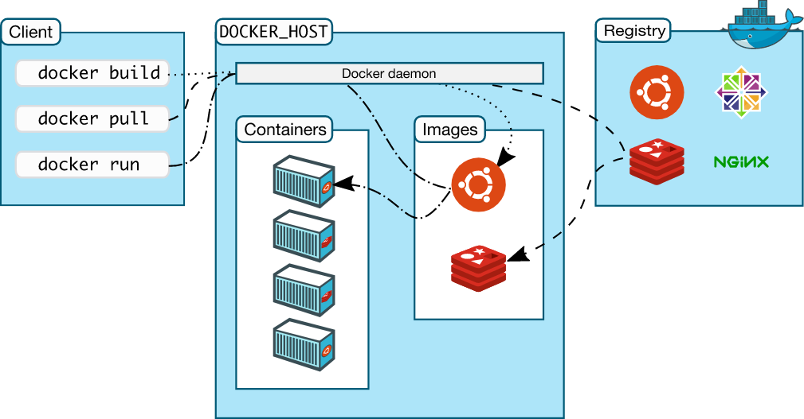

# docker intro

* [image](https://styraxconsulting.atlassian.net/wiki/spaces/Akademie/pages/1087995956) - jsou readonly šablony s instukcemi, jak vytvořit kontejner; jsou uloženy v registru šablon
* [container](https://styraxconsulting.atlassian.net/wiki/spaces/Akademie/pages/1088290824) - je instance image
* [registry](https://styraxconsulting.atlassian.net/wiki/spaces/Akademie/pages/1089601562) - je uložiště pro image
* [client](https://styraxconsulting.atlassian.net/wiki/spaces/Akademie/pages/1103102183) - je volání příkazů pomocí konsole
* [server](https://styraxconsulting.atlassian.net/wiki/spaces/Akademie/pages/1089568890) - (via docker daemon) spravuje image a kontejnery (na obrazku níže jako DOCKER HOST)

                                